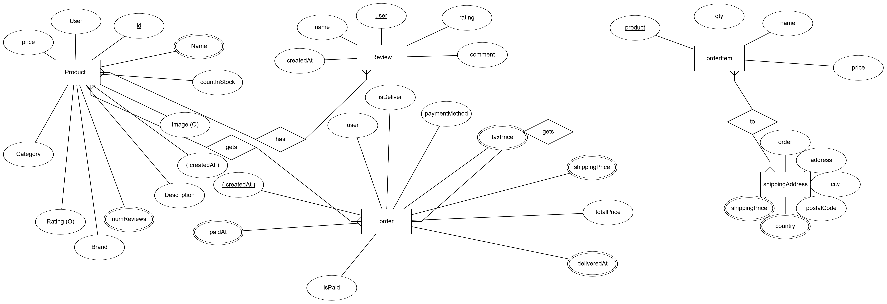

!!ERD DIAGRAM

Frontend of E-Commerce Website
Designed Using React

- USED `REACT-BOOTSTRAP` & `REACT-ROUTER-BOOTSTRAP` FOR STYLING
- USED BOOTSWATCH THEME - `LUX`- USED `FONT AWESOME` ICONS
- USED `REACT PAYPAL BUTTON V2` FOR PAYPAL BUTTONS

Backend of E-commerce website implemented using Django

All purposes of written code are written as comments above and below them.

Requirements:
**asgiref==3.4.1

Django==3.2.6

django-cors-headers==3.7.0

djangorestframework==3.12.4

djangorestframework-simplejwt==4.7.2

gunicorn==20.1.0

Pillow==8.3.1

psycopg2==2.9.1

PyJWT==2.1.0

pytz==2021.1

sqlparse==0.4.1

whitenoise==5.3.0**

How to run:

-virtualenv env

-source env/Scripts/activate

then install requirements if not installed

then python manage.py runserver

